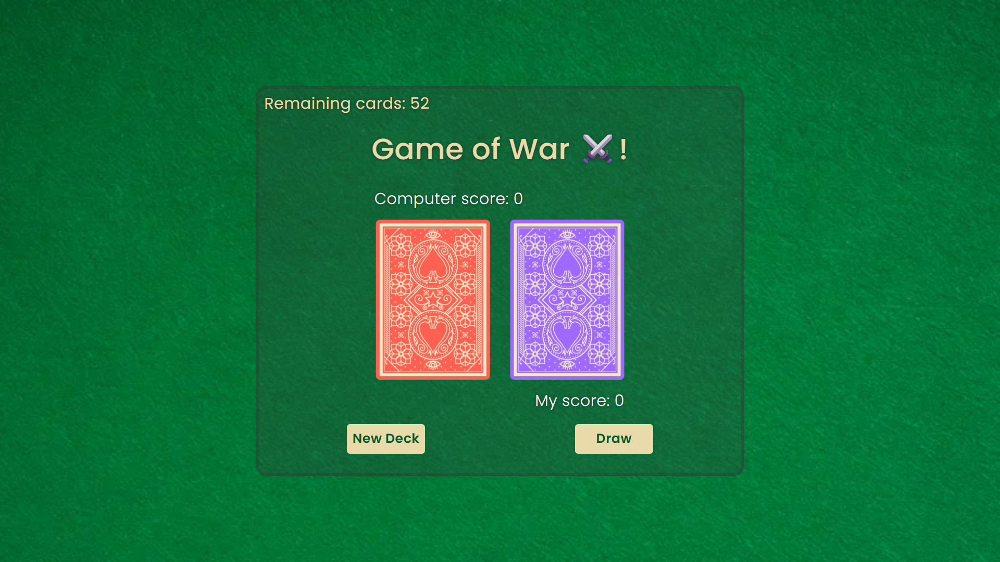

# 🃏 Game of War – Card Game 
The game keeps track of scores between the player and the computer.
A fun and interactive card game built using HTML, CSS, and JavaScript, where the player competes against the computer by drawing cards from a shuffled deck.
The game uses the [Deck of Cards API](https://deckofcardsapi.com/) to fetch real card data and automatically determines the winner of each round.
---

## 🔗 Live Demo
👉 [Play the game here!](https://playdeckofcards.netlify.app/)

---

## 🚀 Features
- Shuffle and start a new deck
- Draw two cards (player vs. computer)
- Automatic comparison of card values
- Live score tracking
- Responsive design (mobile-first with media queries)
- Smooth button interactions (hover, active, disabled states)

---

## 🖼️ Screenshots

---

## 🛠️ Tech Stack
- **HTML5** – structure  
- **CSS3** – styling & responsiveness  
- **JavaScript (ES6)** – game logic and API handling  
- **Deck of Cards API** – card data source  

---

## 📂 Project Structure
├── index.html # Main HTML file
├── style.css # Styling and layout
├── script.js # Game logic & API calls
└── img/ # Assets (background, card placeholders, etc.)
---

## 🧠 How the Game Works
- Click New Deck to shuffle a fresh deck.
- Click Draw to draw two cards.
- Card values are compared automatically.
- The winner of the round earns a point.
- The game ends when all cards are drawn.

---
📜 License

This project is free to use and open-source.
Feel free to fork, modify, and play around 
⭐ If you like this project, consider giving it a star on GitHub!
Happy Coding !
